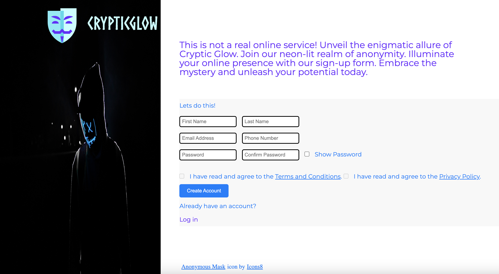
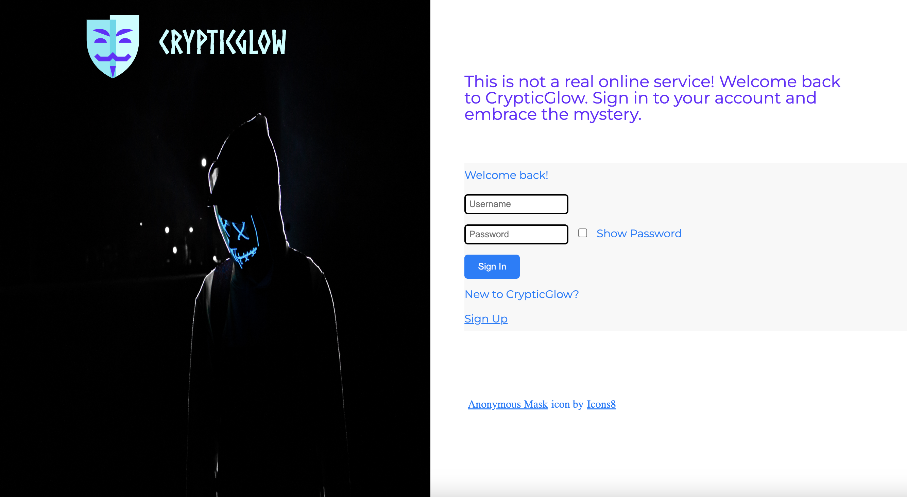

# signUpForm
Personal project: Simplifying sign-ups for a better user experience.

# Introduction 

A sign up form that can be used to create an account and user profile for new users. 

# Installations

# Usage
Sign-up Form Application

The sign-up form application allows users to create an account by providing their personal information. The form consists of several fields with specific functionalities and input requirements. Here's a breakdown of each field and the overall flow of the sign-up process:

First Name and Last Name

The first name and last name fields require users to enter their respective names. These fields accept alphanumeric characters (letters and numbers) and are required for successful form submission.

Email Address

The email address field expects users to provide a valid email address. It includes email validation to ensure the entered value follows the correct format (e.g., `name@example.com`). This field is also required.

Phone Number

The phone number field expects users to enter a US-based phone number in the format of `123-456-7890`. It utilizes a pattern validation to enforce the correct format. This field is also required.

Password

The password field requires users to create a secure password. It follows specific password requirements for increased security. The password must:

- Be at least 8 characters long
- Contain at least one uppercase letter
- Contain at least one lowercase letter
- Contain at least one number or special character

The field also includes a password strength meter to provide real-time feedback on the password's strength. The user is encouraged to create a strong password to enhance account security. This field is required.

Confirm Password

The confirm password field expects users to re-enter their chosen password to ensure accuracy. It must match the password entered in the previous field for successful form submission. This field is also required.

Terms and Conditions and Privacy Policy

The form includes checkboxes for users to indicate their agreement to the terms and conditions and privacy policy. These checkboxes are disabled until the user scrolls through and reads the corresponding documents. Once the user has read and agreed to the terms and policy, they can check these boxes to proceed with the sign-up process.

Sign-up Process Flow

1. The user accesses the sign-up form application.

2. They enter their first name, last name, email address, phone number, password, and confirm password in the respective fields.

3. Real-time validation occurs for each field, ensuring the entered values meet the specified requirements.

4. The user receives feedback on the password strength as they create their password.

5. After filling in all required fields and agreeing to the terms and policy, the user clicks the "Create Account" button.

6. If all inputs are valid and the passwords match, the form is submitted, and the user's account is created.

7. If any field is missing or contains invalid input, appropriate error messages are displayed, guiding the user to correct their input.

8. Once the account is created successfully, the user is redirected to a confirmation or welcome page.


The form includes the required fields and checkboxes for terms and policy agreement. The password strength meter and error messages provide real-time feedback to the user. 

The form includes the required fields and checkboxes for terms and policy agreement. The password strength meter and error messages provide real-time feedback to the user.

Sign-in Page

The sign-in page allows registered users to access their accounts by entering their username and password. Here's a breakdown of the functionality of each field and the overall flow of the sign-in process:

Username or Email Address

The username or email address field requires users to enter their registered username or the email address associated with their account. Users can provide either their username or email address for signing in.

Password

The password field expects users to enter the password associated with their account. The entered password is masked for security purposes.

Sign-in Process Flow

1. The user accesses the sign-in page.

2. They enter their username or email address and password in the respective fields.

3. The user clicks the "Sign In" button.

4. The entered credentials are verified against the stored user information.

5. If the credentials are correct, the user is authenticated, and they are granted access to their account.

6. If the credentials are incorrect, an error message is displayed, notifying the user of the invalid login attempt.

7. The user can then retry entering their credentials or initiate the password recovery process if needed.

The sign-in page includes fields for username or email address and password. The "Sign In" button allows users to initiate the sign-in process. Error messages are displayed if the entered credentials are incorrect.

Heres an example screenshot illustrating the user interface of the sign-up and sign-in forms:




# Technologies Used

HTML, CSS, JavaScript, CD/CI, Node.js

# Features

The features of the sign-up form and sign-in page application include:

1. User Registration: The sign-up form allows new users to create an account by providing their personal information, such as first name, last name, email address, phone number, and password.

2. Input Validation: The form includes validation for input fields to ensure that the provided information meets the specified requirements. For example, the name fields accept only alphanumeric characters, the email field requires a valid email address format, and the password field enforces complexity requirements.

3. Password Strength Meter: The application includes a password strength meter that provides real-time feedback to users about the strength of their chosen password. It helps users create strong and secure passwords by indicating the level of complexity.

4. Password Confirmation: Ensure password and confirm password match: The sign-up form includes validation to ensure that the entered password and confirm password fields match. It compares the values entered in both fields and displays an error message if they do not match, prompting the user to re-enter and confirm their password correctly.

5. Terms and Conditions and Privacy Policy: Users are required to agree to the terms and conditions and privacy policy before creating an account. The application includes checkboxes that users must check to indicate their agreement.

6. User Experience: The application is designed with a user-friendly interface, clear instructions, and intuitive form layout to enhance the overall user experience. It provides visual cues, such as icons and labels, to guide users through the sign-up and sign-in processes.

7. Responsive Design: The application is built with a responsive design approach, ensuring that it adapts to different screen sizes and devices. This allows users to access the sign-up form and sign-in page seamlessly from desktop computers, tablets, and mobile devices.

8. CI/CD (Continuous Integration/Continuous Deployment): The sign-up form application follows CI/CD practices, which involve automating the build, testing, and deployment processes. This ensures that any changes or updates to the application are automatically tested and deployed in a consistent and efficient manner.

9. Google Analytics: The sign-up form application integrates Google Analytics, a web analytics service, to track and analyze user behavior and interactions. It provides valuable insights into user engagement, traffic sources, conversion rates, and other metrics, helping to optimize the application's performance and user experience.

10. Validation that form has been filled out: The sign-up form includes validation to check whether all the required fields have been filled out by the user. If any required field is left empty, an error message is displayed, indicating the missing information and prompting the user to provide the necessary details.

11. Text Length Validation: The sign-up form includes validation to check the length of text input in specific fields. It ensures that the entered text meets the required length criteria, such as minimum and maximum character limits, and displays an error message if the input does not meet the specified criteria.

12. Styling Validations: The sign-up form includes styling validations to provide visual cues and feedback to the user regarding the validity of their input. It dynamically applies different styles or colors to the form fields, indicating whether the input is valid or invalid based on specific criteria, such as formatting, length, or character requirements.

13. Client Side Form Validation: The sign-up form performs client-side form validation, which means that validation checks are done on the user's device before the form is submitted to the server. This enables instant feedback to the user and helps prevent unnecessary server requests for invalid or incomplete form submissions.

14. Color change depending on if user input is valid or invalid: The sign-up form dynamically changes the color of the form fields or their borders based on the validity of the user's input. For example, when the input is valid, the field may have a green color, and when it is invalid, the field may have a red color, providing visual feedback to the user.

15. Privacy Policy: The sign-up form includes a checkbox that requires users to agree to the privacy policy before creating their account. By checking the box, users acknowledge that they have read and agreed to the privacy policy, which outlines how their personal information will be collected, used, and protected.

16. Display Error Messages: The sign-up form displays error messages when there are validation errors or when the user has not filled out required fields. These error messages provide specific information about the issues encountered, helping the user understand what needs to be corrected in their form submission.

17. Email Security Measure - Sanitization: The sign-up form includes a security measure to sanitize the entered email address. Sanitization involves removing or neutralizing potentially harmful or malicious content from the email input, helping to prevent security vulnerabilities and protect the application and its users.

18. Password show or hide checkbox: The sign-up form includes a checkbox that allows users to toggle the visibility of the entered password. When checked, it displays the password in plain text, enabling the user to see the characters they have entered. When unchecked, it masks the password for added security.

19. Works on multiple screen sizes: The sign-up form application is designed to be responsive and compatible with various screen sizes and devices. It adjusts its layout and components dynamically to provide an optimal user experience across different devices, including desktops, tablets, and mobile phones.

20. Allow user to input information into forms: The sign-up form includes input fields where users can enter their information, such as first name, last name, email address, phone number, and password. Users can interact with these fields and provide the required information to create their account.

21. Create an alternative sign-in page: In addition to the sign-up form, the application also includes a sign-in page. The sign-in page allows users who already have an account to enter their credentials, such as username and password, to access their account. It provides a separate interface and functionality for existing users to log in.

These features collectively provide a robust and secure user registration and authentication system, ensuring a smooth and reliable experience for users interacting with the application.

# Live

https://adilshads.github.io/signUpForm/index.html
https://adilshads.github.io/signUpForm/index2.html

# Installation

1. Open your preferred terminal or command-line interface on your computer.

2. Navigate to the directory or location where you want to clone the project.

3. Go to the GitHub repository page of the project you want to clone. You can find the repository by searching for its name on GitHub or by accessing the repository URL directly.

4. On the repository page, click on the "Code" button, which is located just above the list of files.

5. Click on the clipboard icon next to the repository URL to copy the clone URL.

6. Return to your terminal or command-line interface and enter the following command: 

git clone <repository-url>

Replace <repository-url> with the URL you copied in the previous step. For example:

git clone https://github.com/your-username/repository-name.git

7. Press Enter to execute the command.

8. Git will start cloning the repository to your local machine. Once the cloning process is complete, you will have your own copy of the project on your computer.

9. You can now navigate to the cloned project directory by using the cd command followed by the directory name. For example:

cd repository-name

10. You can then start working with the project files, making modifications, running the application, or using any other available functionalities.

# License

The project is licensed under the MIT License. The MIT License is a permissive open-source license that allows you to use, modify, and distribute the project's code for both commercial and non-commercial purposes. Below is the MIT License text:

```
MIT License

Copyright (c) [2023] [Adil Shad]

Permission is hereby granted, free of charge, to any person obtaining a copy
of this software and associated documentation files (the "Software"), to deal
in the Software without restriction, including without limitation the rights
to use, copy, modify, merge, publish, distribute, sublicense, and/or sell
copies of the Software, and to permit persons to whom the Software is
furnished to do so, subject to the following conditions:

The above copyright notice and this permission notice shall be included in all
copies or substantial portions of the Software.

THE SOFTWARE IS PROVIDED "AS IS", WITHOUT WARRANTY OF ANY KIND, EXPRESS OR
IMPLIED, INCLUDING BUT NOT LIMITED TO THE WARRANTIES OF MERCHANTABILITY,
FITNESS FOR A PARTICULAR PURPOSE AND NONINFRINGEMENT. IN NO EVENT SHALL THE
AUTHORS OR COPYRIGHT HOLDERS BE LIABLE FOR ANY CLAIM, DAMAGES OR OTHER
LIABILITY, WHETHER IN AN ACTION OF CONTRACT, TORT OR OTHERWISE, ARISING FROM,
OUT OF OR IN CONNECTION WITH THE SOFTWARE OR THE USE OR OTHER DEALINGS IN THE
SOFTWARE.
```

# Known Issuea

Responsive Design: The application currently does not work perfectly on smaller screens, such as phone screens. The layout and user experience may be compromised, and some elements may not display properly. This issue is related to the responsiveness of the application and is being actively worked on to improve the user experience on all screen sizes.

Please note that this is not an exhaustive list of issues and is subject to change as the project evolves. If you encounter any other issues while using the application, please report them to the project's issue tracker on GitHub or contact the project maintainer for further assistance.

# Credit


This project includes code from the following sources:

[Reset: CSS](https://meyerweb.com/eric/tools/css/reset/index.html): 
Used for [Resetting styles for crossbrowser compatibility](https://meyerweb.com/eric/tools/css/reset/reset.css).

